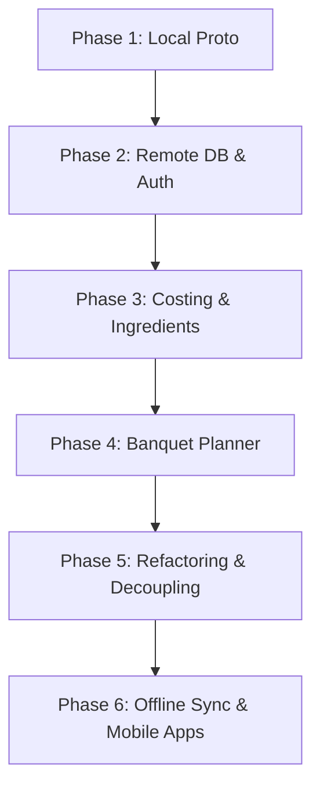

# База знаний Chef OS

Добро пожаловать в документацию проекта **Chef OS** — мобильной операционной системы для управления процессами на профессиональной кухне во время смены.

Этот путеводитель предназначен для быстрого понимания устройства проекта, текущего состояния разработки и планов на будущее.

---

## 🗺️ Карта документов

Вся документация разделена по направлениям для удобной навигации:

### 🎯 Концепция и Продукт
* **[Контекст проекта](file:///c:/Users/wiwal/GIT/chef-os-demo/docs/PROJECT_CONTEXT.md) (`docs/PROJECT_CONTEXT.md`)** — подробное описание бизнес-концепции, целевой аудитории (Шеф, Сушеф, Повар, Закупщик), решаемых болей и преимуществ перед конкурентами.
* **[Логика взаимодействия](file:///c:/Users/wiwal/GIT/chef-os-demo/docs/INTERACTION_LOGIC.md) (`docs/INTERACTION_LOGIC.md`)** — продуктовые правила работы интерфейса под нагрузкой сервиса (почему повара отправляют сигналы, а шефы их подтверждают; правила расположения навигации и FAB).
* **[Справочник быстрых действий](file:///c:/Users/wiwal/GIT/chef-os-demo/docs/QUICK_ACTIONS.md) (`docs/QUICK_ACTIONS.md`)** — структурированные сигналы кнопки FAB (проблемы, чек-листы, нехватка продуктов, вызов сушефа).
* **[Профессиональные заметки о кухне](file:///c:/Users/wiwal/GIT/chef-os-demo/docs/PROFESSIONAL_KITCHEN_NOTES.md) (`docs/PROFESSIONAL_KITCHEN_NOTES.md`)** — требования санитарных стандартов (FDA, Michelin) и их влияние на дизайн приложения (привязка задач к станциям/цехам, правила гигиены).

### 🛠️ Техническая архитектура и Данные
* **[Архитектура системы](file:///c:/Users/wiwal/GIT/chef-os-demo/docs/ARCHITECTURE.md) (`docs/ARCHITECTURE.md`)** — стек технологий (React, Vite, Tailwind CSS, Supabase, Vercel) и стратегия оффлайн-кэширования через PWA App Shell.
* **[Модель данных](file:///c:/Users/wiwal/GIT/chef-os-demo/docs/DATA_MODEL.md) (`docs/DATA_MODEL.md`)** — описание структуры таблиц в Supabase, принципов мультиарендности (Tenant Model по ресторанам) и политик безопасности (RLS).
* **[Интеграция Supabase и Auth](file:///c:/Users/wiwal/GIT/chef-os-demo/docs/SUPABASE_AUTH.md) (`docs/SUPABASE_AUTH.md`)** — настройка авторизации через Google OAuth, конфигурация redirect URL и механизмы автоматического развертывания демо-данных при первом входе.

### 📋 Трекинг проекта и Запуск
* **[Чек-лист готовности продукта](file:///c:/Users/wiwal/GIT/chef-os-demo/docs/PRODUCT_COMPLETION_CHECKLIST.md) (`docs/PRODUCT_COMPLETION_CHECKLIST.md`)** — детальный реестр реализованных и планируемых фич по модулям (Чек-листы, Профиль, ТТК, Склад, Чат, Мобильное приложение).
* **[Активные задачи](file:///c:/Users/wiwal/GIT/chef-os-demo/docs/TASKS.md) (`docs/TASKS.md`)** — рабочий TODO-лист разработчиков с разбивкой по фазам.
* **[Реестр решений](file:///c:/Users/wiwal/GIT/chef-os-demo/docs/DECISIONS.md) (`docs/DECISIONS.md`)** — лог принятых архитектурных и продуктовых решений (ADR) с обоснованием.
* **[Руководство по запуску (Runbook)](file:///c:/Users/wiwal/GIT/chef-os-demo/docs/RUNBOOK.md) (`docs/RUNBOOK.md`)** — инструкции по локальной разработке, сборке, верификации PWA, проверке интеграции Supabase и деплою на Vercel.
* **[Архив отчетов по сессиям](file:///c:/Users/wiwal/GIT/chef-os-demo/docs/session_reports/) (`docs/session_reports/`)** — история изменений проекта по дням.

---

## 📈 Дорожная карта (Roadmap) проекта

Развитие Chef OS разбито на последовательные этапы:

### ✅ Фаза 1: Локальный прототип (Выполнено)
* Реализация мобильного интерфейса смены (задачи, стоп-листы).
* Скелет экрана ТТК и процесса по цехам.
* Локальные моки данных и симуляция отправки быстрых сигналов.

### ✅ Фаза 2: Интеграция с Supabase и Google OAuth (Выполнено)
* Подключение облачной БД Supabase (проект `zqkwfflhjuckjmxqqheh`).
* Настройка входа через Google.
* Создание авто-генерации демо-ресторана при первом входе.
* Синхронизация задач смены, чек-листов, сигналов склада и кухонного чата в реальном времени.
* Защита данных на уровне Row Level Security (RLS) по `restaurant_id`.

### ✅ Фаза 3: Себестоимость (Food Cost) и База ингредиентов (Выполнено)
* Добавлена вкладка **«База»** для управления ингредиентами, ценами и процентом отходов (loss factor).
* Интегрирован детальный расчет себестоимости блюда в ТТК (расчет брутто/нетто для каждого ингредиента).
* Добавлен расчет маржи и наценки в реальном времени.
* Внедрена система предупреждения об опасной наценке (Food Cost > 30% подсвечивается красным).
* Автоматический пересчет стоимости всех блюд при изменении цены ингредиента поставщика.

### ⏳ Фаза 4: Конструктор банкетов и мероприятий (В планах)
* Проектирование таблиц событий (`events`) и масштабируемых рецептов (`event_recipes`).
* Интерфейс создания банкета с числом гостей и меню.
* **Суммарный лист закупок**: автоматический расчет общего веса всех ингредиентов под банкет с учетом процента потерь на очистку.
* Расчет экономики мероприятия (общий фудкост банкета, планируемая маржа).
* Автоматическая генерация задач заготовки (Mise en Place) для поваров разных цехов под банкет.

### 🛠️ Фаза 5: Рефакторинг и модульность (В процессе)
* Разделение гигантского монолитного файла `src/main.jsx` на модули и отдельные страницы.
* Интеграция менеджера состояния (Zustand) для избавления от избыточных `useState` в App.
* Выделение UI-компонентов (модальные листы, формы ввода, карточки).

### 📱 Фаза 6: Оффлайн-очередь и Мобильные сторы (В планах)
* Создание фоновой очереди действий (Sync Queue) для гарантированной доставки данных при нестабильном Wi-Fi на кухне.
* Сборка нативных приложений под iOS и Android с помощью Capacitor.
* Интеграция камеры для фото-отчетов о недостачах и сбоях.
